# 📚 Library Management System

A simple full-stack application built as a *technical task* for MindTorches,  
using *.NET  + *Angular  + *Onion Architecture, **DDD*,  
and *EF Core + ADO.NET (Stored Procedures)*.
## 🧩 Features

- Manage *Books* (Add, Update, Delete, List, Get by Id).  
- Manage *Categories* (Add, Update, Delete, List).  
- A *Book* can belong to multiple *Categories*.  
- “Get All Books with Categories” implemented via *Stored Procedure (ADO.NET)*.  
- API documented using *Swagger UI*.  
- Frontend built using *Angular Material* (responsive + clean design).
## ⚙ Tech Stack

| Layer | Technology |
|-------|-------------|
| Backend | ASP.NET  |
| Architecture | Onion Architecture + Domain-Driven Design |
| ORM | Entity Framework Core |
| Database | SQL Server |
| Data Access | EF Core + ADO.NET (Stored Procedure) |
| Frontend | Angular  + Angular Material |
| Language | C# (Backend), TypeScript (Frontend), HTML, CSS |
## 🏛️ Architecture Overview
Library.sln
│
    ├── Library.Domain → Entities + Interfaces
    ├── Library.Application → DTOs + Services + Business Logic
    ├── Library.Infrastructure → EF Core + Repositories + ADO.NET
    └── Library.API → Controllers + Swagger
    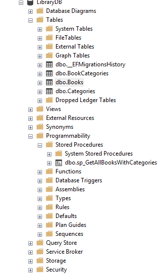
**Why Onion Architecture?**

- Separates business logic from external concerns
- Changes in UI/Database do **not** affect core logic
- Promotes **testability, maintainability, and scalability**

---

## 🛢️ Database Model
Book (Id, Title, Author, Year),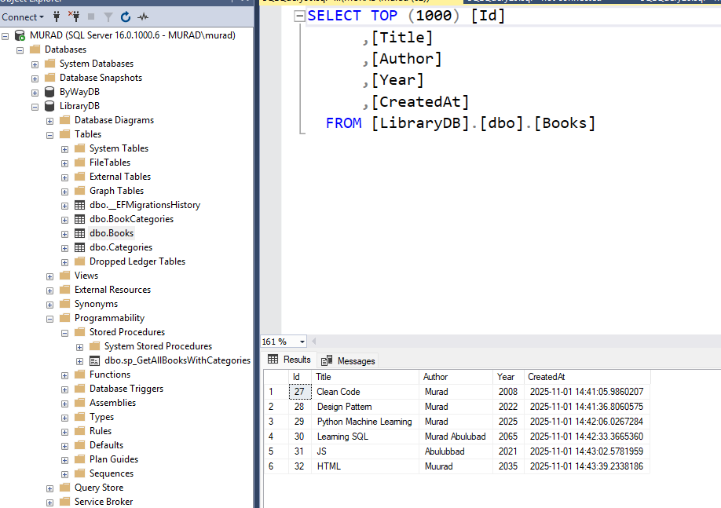
Category (Id, Name)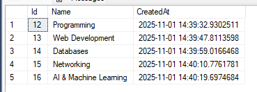
BookCategory (BookId, CategoryId) ← Many-to-Many Relation,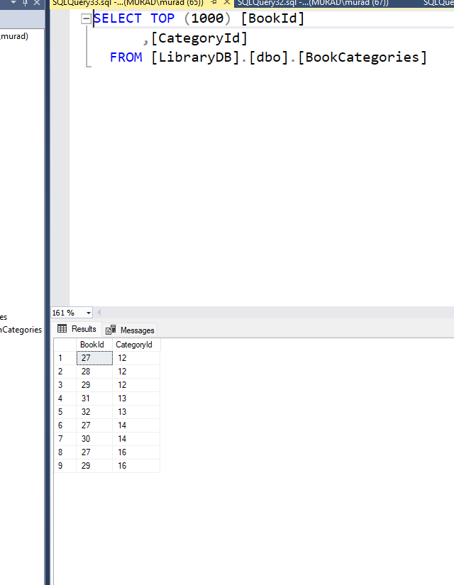

Stored Procedure Used: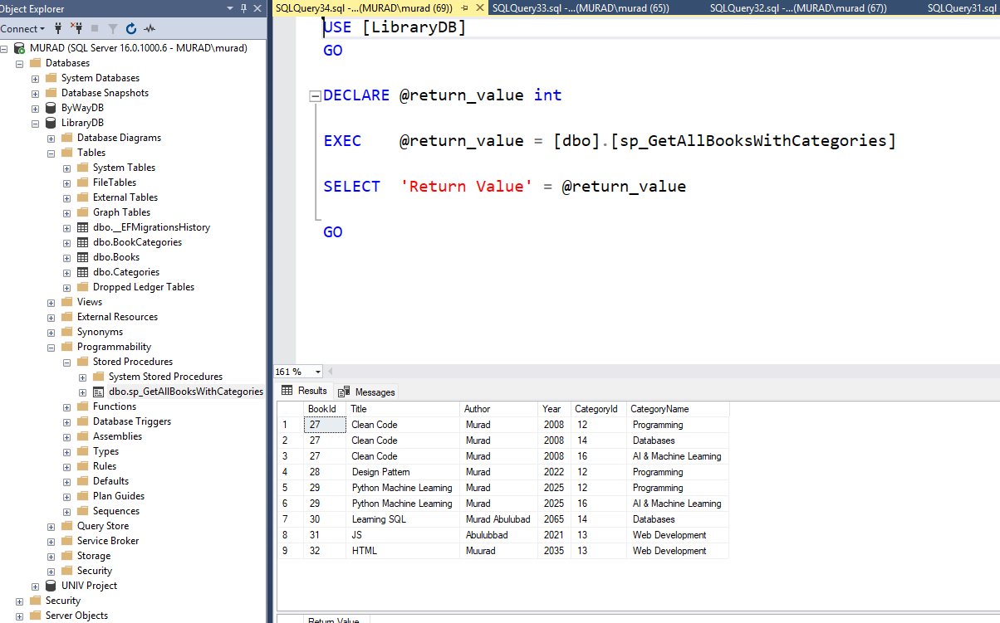

IF OBJECT_ID('sp_GetAllBooksWithCategories', 'P') IS NOT NULL
    DROP PROCEDURE sp_GetAllBooksWithCategories;
GO

CREATE PROCEDURE sp_GetAllBooksWithCategories
AS
BEGIN
    SELECT
        b.Id AS BookId,
        b.Title,
        b.Author,
        b.Year,
        c.Id AS CategoryId,
        c.Name AS CategoryName
    FROM Books b
    LEFT JOIN BookCategories bc ON b.Id = bc.BookId
    LEFT JOIN Categories c ON bc.CategoryId = c.Id
    ORDER BY b.Id;
END;
GO

EXEC sp_GetAllBooksWithCategories;

## 📄 Books Endpoints 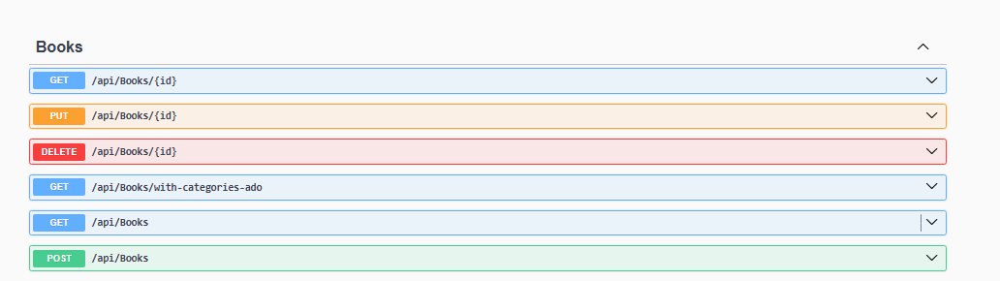

Method	Endpoint	Description
## Books

## GET	/api/Books  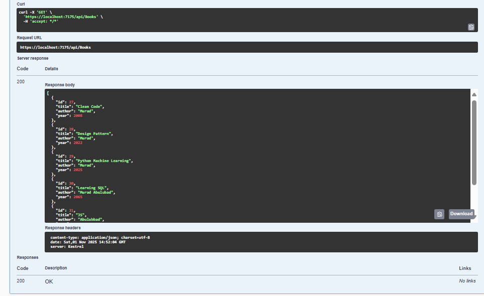
	Get all books (EF Core – With out categories) 
   
## GET	/api/Books/{id}:
	Get a single book by ID (With CategoryIds ) Returns a book with its CategoryIds to enable dynamic add/remove of category links during updates.
[alt text](src/assets/image-7.png)
## POST	/api/Books	
 → Creates a new book (you can optionally include categoryIds to link categories during creation)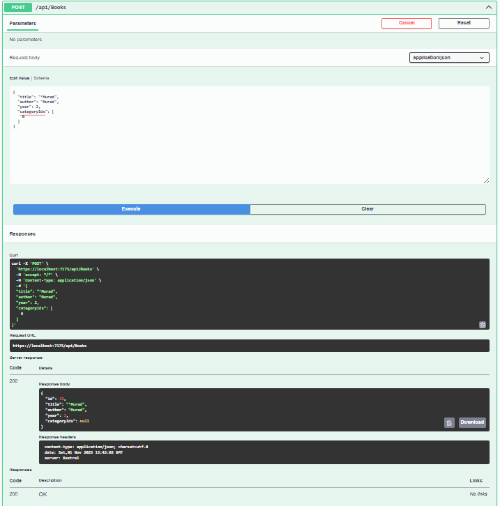
## PUT	/api/Books/{id}	→
 Used to update an existing book.
You first use the id to identify which book to update,
then its current categoryIds show the existing relationships,
and when you edit and save, the API updates the linked categories accordingly.
## DELETE	/api/Books/{id} 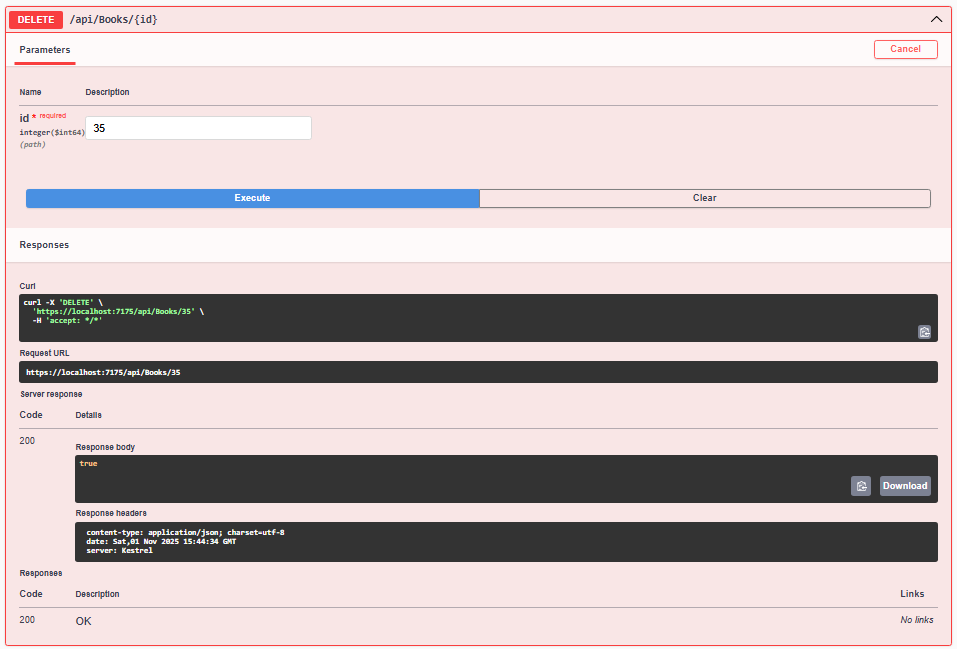
	Delete book  
GET	/api/Books/with-categories-ado	Get Books + Category Names (ADO.NET + Stored Procedure) ✅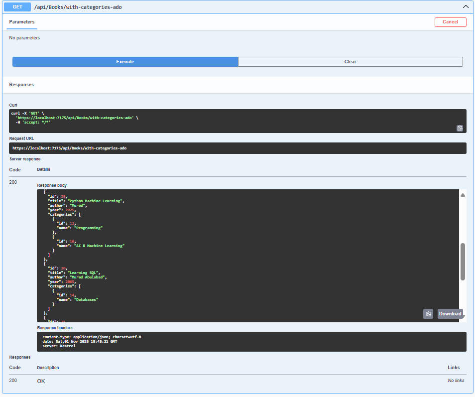
## Categories
## Get/api/Categories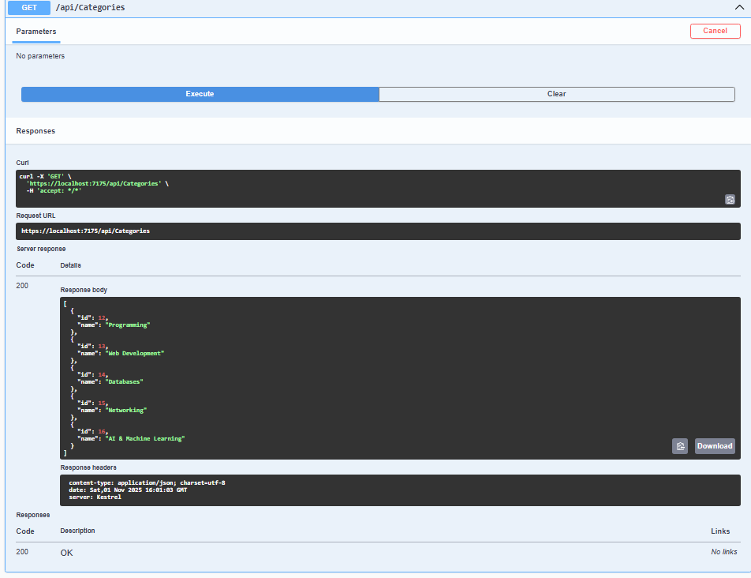
	Retrieves a list of all categories.
## POST	/api/Categories 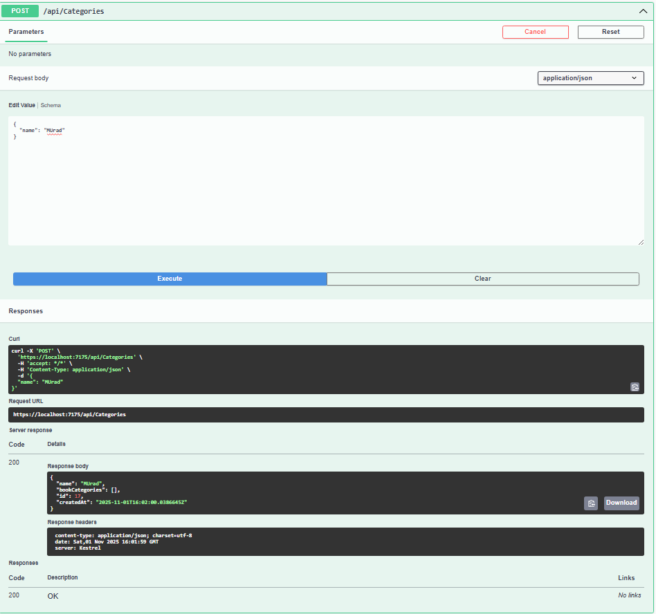
	Creates a new category. 
## PUT	/api/Categories/{id}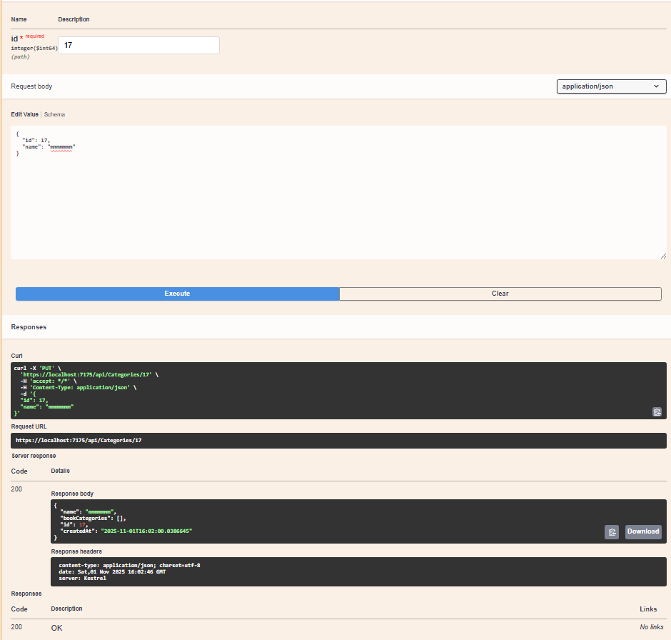
	Updates an existing category by its ID.
 ## DELETE	/api/Categories/{id} 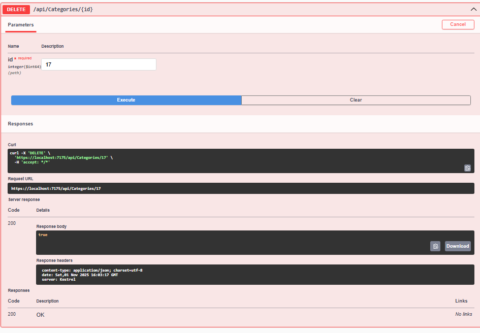
 	Deletes a category by its ID.
💻 Frontend (Angular) Overview

🧱 Framework & UI

The frontend was built using Angular + Angular Material
to ensure a clean, responsive, and consistent user interface.

Core features implemented:
	•	Full CRUD operations for Books and Categories
	•	Integrated with the backend API (via BookService & CategoryService)
	•	Separate routes for each operation
	•	Angular Material UI components (Tables, Forms, Buttons, Selects)

🧩 Main Features
	•	📚 Books CRUD: Add ##, Edit, Delete, and View books 

	•	🏷 Categories CRUD: Manage all categories easily
	•	🔄 Many-to-Many Link: Each book can belong to multiple categories 
	•	⚡ Stored Procedure View: Load all books with category names via ADO.NET
	•	🎨 Responsive Design: Built with Angular Material UI components

View                        Description
                  

  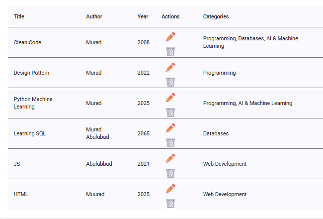 //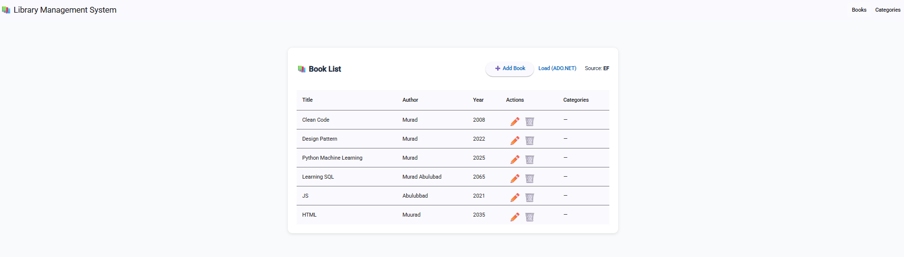//View📚 Book List View  — Displays all books and linked categories 

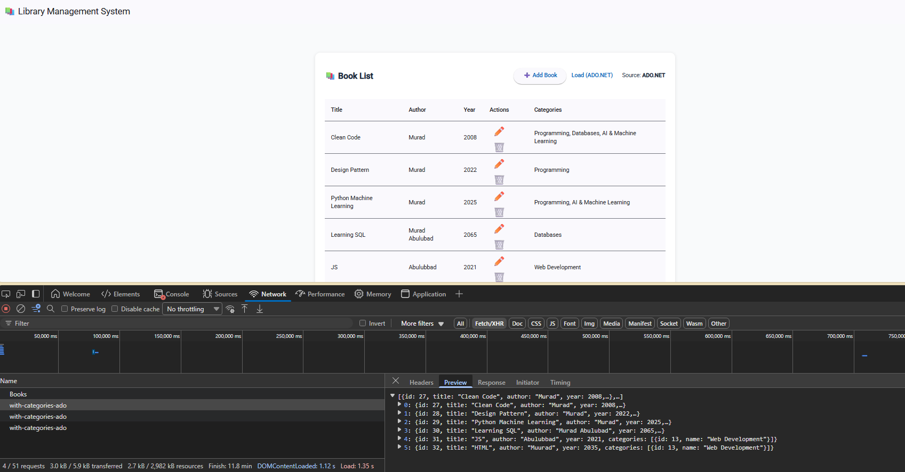    ⚡ Load via ADO.NET View — Shows data fetched via stored procedure

  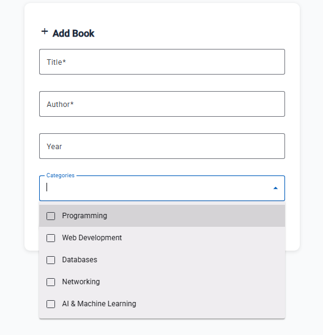  ➕ Add Book — Add book details and select categories

 [alt text](src/assets/image-18.png) ✏ Edit Book — Update existing book and its categories

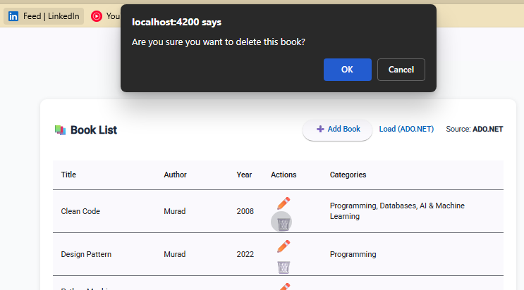   Delete Book — Remove a book and its relationships
## Categories
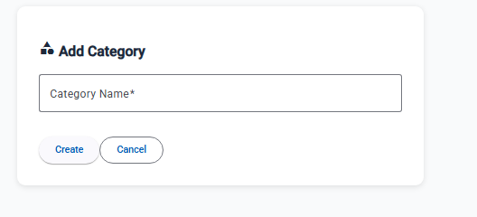 Add Book — Add Category 
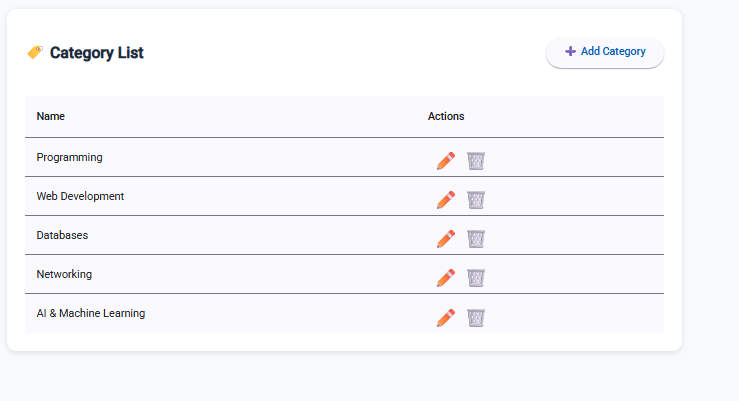 List Category
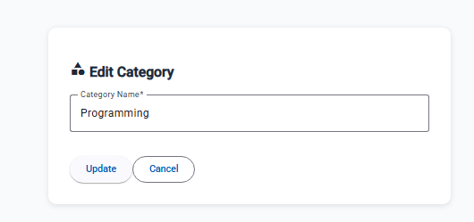 Edit Category